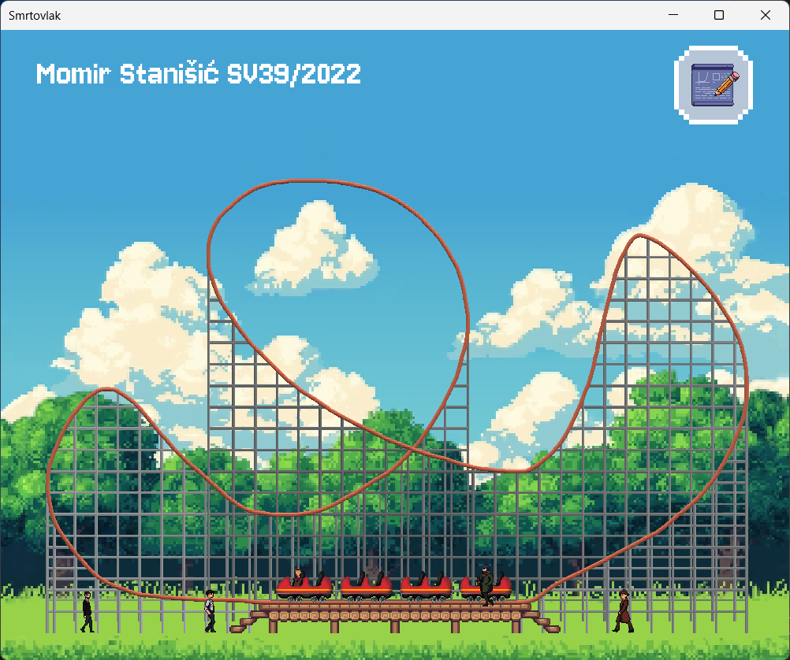
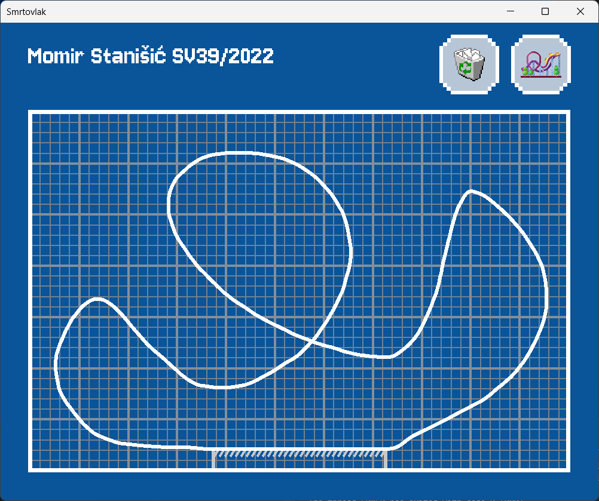

# Usage
- ESC - quit the app
- R - reset current mode
- F - toggle fullscreen
- Space - add new passenger
- Enter - start a ride
- Mouse - control passengers / draw

Latest track drawing is stored in `smrtovlak.track` file.

# Simulation mode

# Blueprint mode
